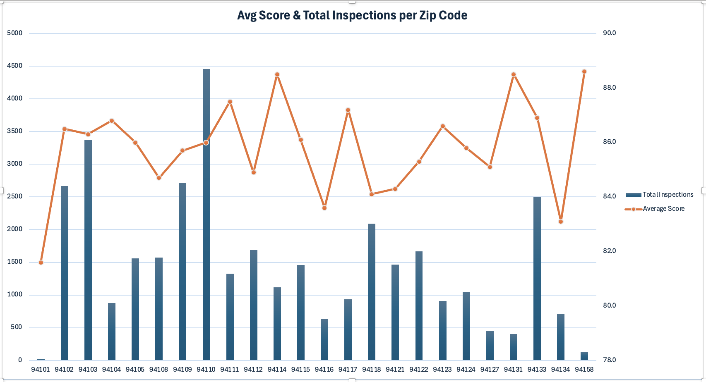
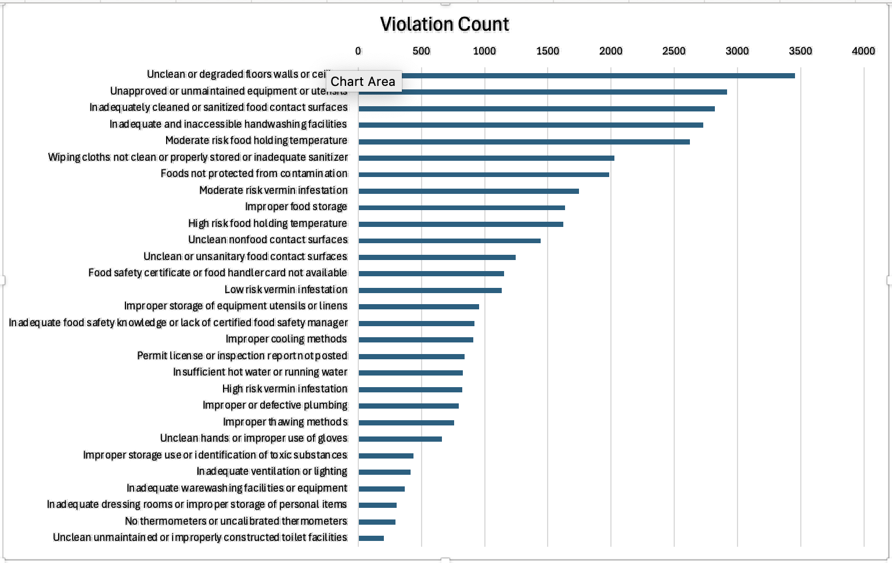
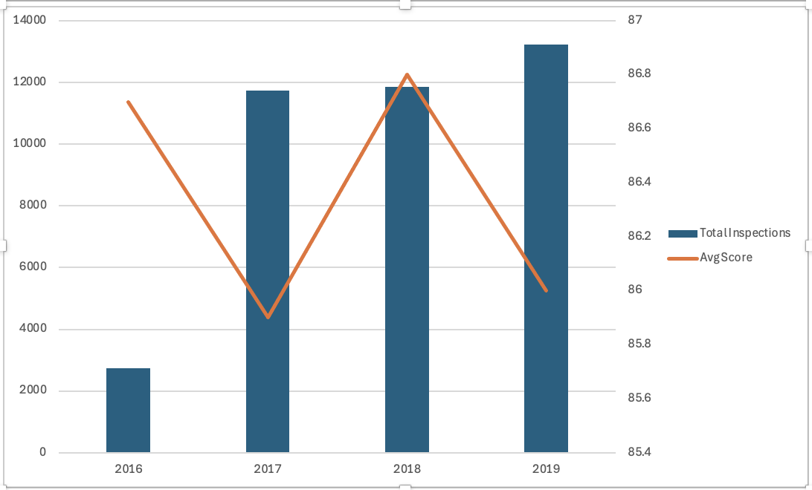
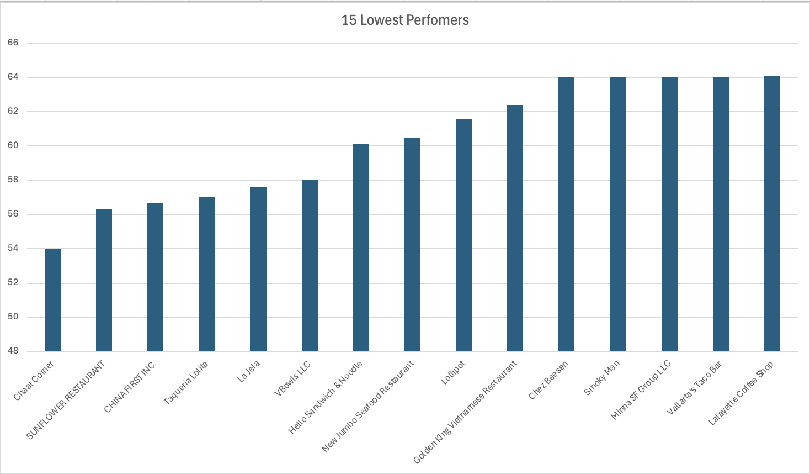

# SF Restaurant Health & Risk Analysis

**Author:** Rashaun Vaughn  
**Tools:** BigQuery (SQL) · Microsoft Excel · GitHub  
**Data Source:** [DataSF — Restaurant Scores LIVES Standard](https://data.sfgov.org/Health-and-Social-Services/Restaurant-Scores-LIVES-Standard/pyih-qa8i)

---

## Project Summary

Analyzed 39,536 San Francisco restaurant health inspection records from 2016 to 2019 to identify geographic risk patterns, the most common violations, repeat high-risk offenders, and citywide score trends over time. This project mirrors real-world business and data analyst workflows — querying raw data in BigQuery, cleaning and visualizing in Excel, and communicating findings clearly.

---

## Key Findings

- **Lowest-scoring zip code:** 94134 (Visitacion Valley) with an average score of 83.1
- **Highest-scoring zip code:** 94158 (Mission Bay) with an average score of 88.6
- **Most cited violation:** Unclean or degraded floors, walls, or ceilings — accounting for 8.58% of all violations
- **Citywide scores remained stable** between 85.9 and 86.8 from 2016 to 2019
- **50 businesses** had 3 or more inspections with an average score below 75, flagged as high risk
- **Chaat Corner** (320 3rd St, 94107) recorded the lowest average score of 54 across 10 inspections

---

## Visualizations

### 1. Average Inspection Score by Zip Code
> Zip codes ranked lowest to highest. Scores below 85 are highlighted in red.



---

### 2. Top 15 Most Common Violations
> Citation counts across all inspections from 2016–2019.



---

### 3. Citywide Inspection Score Trend (2016–2019)
> Average score across all SF restaurants by year.



---

### 4. Top 15 Highest Risk Businesses
> Restaurants with 3 or more inspections and an average score below 75, ranked by avg score.



---

## Top 15 Highest Risk Businesses

| Business | Address | Zip | Inspections | Avg Score | Lowest Score |
|----------|---------|-----|-------------|-----------|--------------|
| Chaat Corner | 320 3rd St | 94107 | 10 | 54.0 | 54 |
| Sunflower Restaurant | 506 Valencia St | 94103 | 17 | 56.3 | 46 |
| China First Inc. | 336 Clement St | 94118 | 19 | 56.7 | 48 |
| Taqueria Lolita | 750 Phelps St | 94124 | 11 | 57.0 | 57 |
| La Jefa | 445 Bayshore Blvd | 94107 | 15 | 57.6 | 51 |
| VBowls LLC | 1200 Vermont St | 94110 | 9 | 58.0 | 58 |
| Hello Sandwich & Noodle | 426 Larkin St | 94102 | 18 | 60.1 | 55 |
| New Jumbo Seafood Restaurant | 1532 Noriega St | 94122 | 20 | 60.5 | 57 |
| Lollipot | 890 Taraval St | 94116 | 19 | 61.6 | 45 |
| Golden King Vietnamese Restaurant | 757 Clay St | 94108 | 18 | 62.4 | 55 |
| Chez Beesen | 200 Pine St | 94104 | 6 | 64.0 | 64 |
| Smoky Man | 1310 Noriega St | 94122 | 8 | 64.0 | 64 |
| Minna SF Group LLC | 142 Minna St | 94105 | 10 | 64.0 | 64 |
| Vallarta's Taco Bar | 3033 24th St | 94110 | 9 | 64.0 | 64 |
| Lafayette Coffee Shop | 611 Larkin St | 94109 | 17 | 64.1 | 62 |

---

## SQL Queries

All queries were written and executed in **Google BigQuery**. See [Queries.SQL] for the full code.

| Query | Description |
|-------|-------------|
| Query 1 | Average inspection score by zip code, ordered lowest to highest |
| Query 2 | Top 15 most common violation types with percentage of total |
| Query 3 | Citywide average score and inspection count by year |
| Query 4 | High-risk businesses with 3+ inspections and avg score below 75 |

---

## File Structure

```
sf-restaurant-analysis/
├── README.md
├── queries.sql
├── sf_restaurant_analysis.xlsx
├── charts/
│   ├── chart1_zip_scores.png
│   ├── chart2_violations.png
│   ├── chart3_trends.png
│   └── chart4_high_risk.png
└── data/
    ├── query1_zip_scores.csv
    ├── query2_violations.csv
    ├── query3_trends.csv
    └── query4_high_risk.csv
```

---

## Skills Demonstrated

- **SQL** — aggregation, window functions, date parsing, HAVING filters, subqueries
- **Data cleaning** — removing invalid records, standardizing formats, handling nulls
- **Excel** — multi-sheet workbook, column and bar charts, conditional formatting
- **Business storytelling** — translating raw inspection data into actionable public health insight
- **GitHub** — version control, project documentation, portfolio presentation

---

*Data provided by the San Francisco Department of Public Health via [DataSF](https://data.sfgov.org).*
